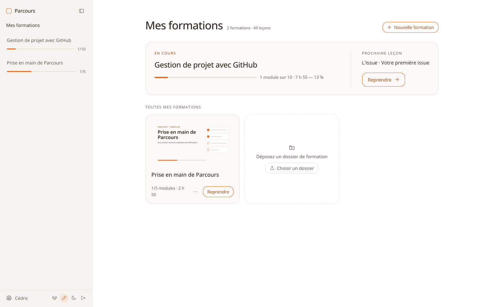
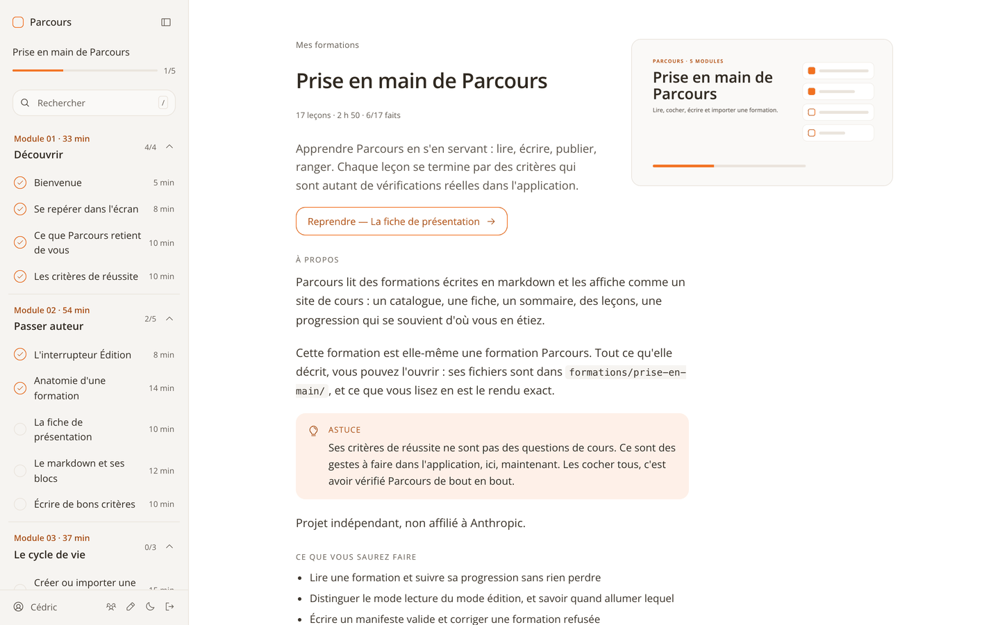
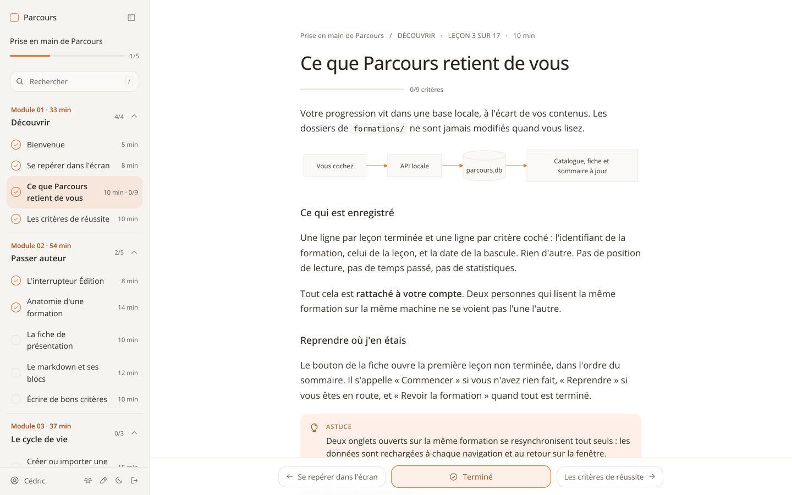
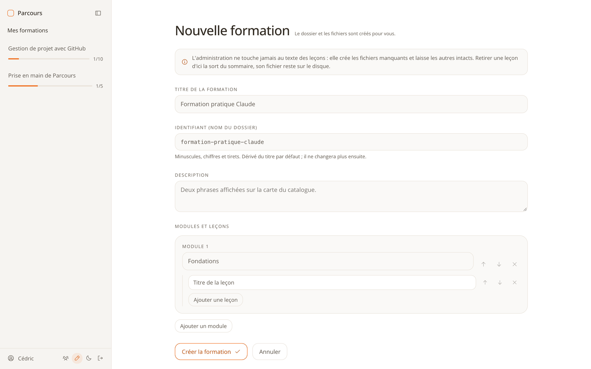
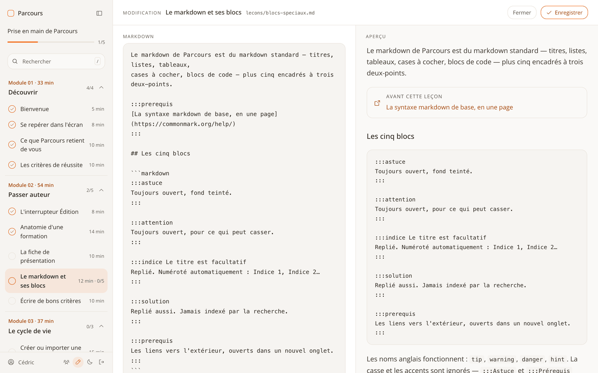
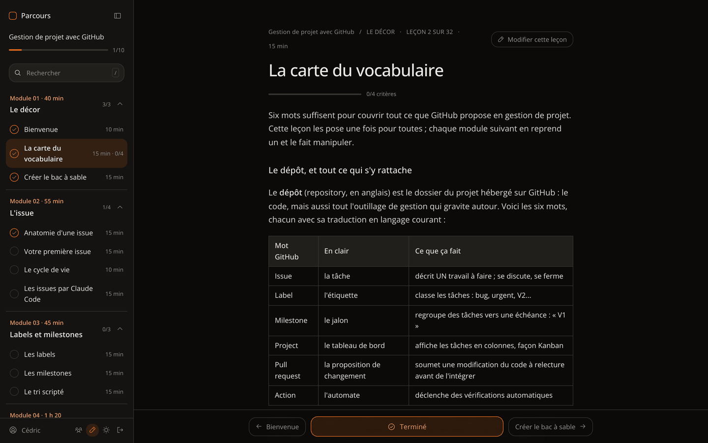
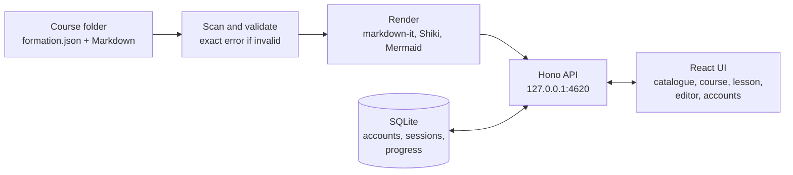

# Parcours

**Write a course as a folder of Markdown files — by hand or with Claude Code — and read it like a real course site,
with progress that remembers where you left off.**


[](LICENSE)



## Overview

Course platforms impose their editor, their format, or a layout that cannot show highlighted code, diagrams and
exercises with a folded solution. And none of them can tell you "you were here" when you come back three days later.

Parcours takes the opposite route. A course is a plain folder: a `formation.json` that lists modules and lessons, one
Markdown file per lesson. Because it is plain text, an AI agent can write a whole course in one go. You drop the folder
into Parcours, which validates it and serves it as a course site: catalogue, outline, lessons, search, and progress you
tick off as you go.

The interface is in French. Two complete courses ship with the repository, including one that teaches Parcours from
inside Parcours.

| Course outline | Lesson with tickable criteria |
|---|---|
|  |  |

## Features

- **A course is a folder.** Stable identifiers: renaming a title never loses progress. An invalid course stays
  visible in the catalogue with its exact error (`modules[2].lecons[0].id manquant`).
- **Lessons that read like a course.** Highlighted code (Shiki), Mermaid diagrams, images, tip / warning / hint /
  solution blocks, and a banner naming the lessons a lesson assumes.
- **Every checkbox is a success criterion.** Each lesson shows `n/N`; ticking the last one completes the lesson.
  "Resume" opens the first unfinished lesson.
- **Full-text search** within a course, light and dark modes.
- **Accounts and roles.** The first launch creates the administrator. Admins write and manage accounts; readers read
  and tick. Each account keeps its own progress. Self sign-up with email confirmation and password reset exist, closed
  by default and only active once an SMTP server is configured.
- **Authoring tools, off by default.** Behind an "Édition" switch reserved to admins: create a course, edit its
  structure, edit a lesson with live preview, import a folder, archive, restore. The server enforces the role; the
  switch only hides.
- **Nothing is ever deleted.** Archive and trash move folders; they never erase. The editor refuses to save if the file
  changed on disk in the meantime.
- **Nothing leaves the machine.** Fonts, icons, highlighting and diagrams are bundled; the interface makes no network
  request.

| New course | Lesson editor |
|---|---|
|  |  |

## Getting started

Requires Node 22 or later.

```bash
git clone https://github.com/cedricgicquiaud/parcours.git
cd parcours
npm install
npm run build && npm start      # http://127.0.0.1:4620
```

On first launch, Parcours asks you to create the administrator account. Then open **« Prise en main de Parcours »**
in the catalogue: 5 modules, 17 lessons, and every success criterion is something to do in the app.

| Command | What it does |
|---|---|
| `npm run dev` | API server (port 4620) and Vite UI (http://localhost:5173) |
| `npm test` | Vitest suite |
| `npm run typecheck` | `tsc --noEmit` |
| `npm run build` | Typecheck and build the UI |
| `npm start` | One process serving the API and the UI on `127.0.0.1:4620` |

| Variable | Default |
|---|---|
| `PARCOURS_FORMATIONS_DIR` | `formations/` in the repository |
| `PARCOURS_DB_PATH` | `~/Library/Application Support/Parcours/parcours.db` (set it outside macOS) |
| `PARCOURS_SMTP_URL` | unset: no email is sent |

## Writing a course with Claude Code

This is how the two bundled courses were written. The format is plain text, so the agent writes the files and Parcours
checks them.

1. Describe the subject to Claude Code, and point it at the format:

   ```text
   Read docs/FORMAT.md, then write a course in formations/<course-id>/ about <subject>:
   a formation.json and one Markdown file per lesson. 4 modules of 3 to 5 lessons,
   15 minutes each. End every lesson with 3 to 6 success criteria written as
   checkboxes, each one a concrete action the reader can verify. Use :::astuce
   and :::solution blocks where they help. Then run `npm start` and fix anything
   Parcours reports as invalid.
   ```

2. Parcours picks the folder up on the next catalogue refresh, without a restart. If the manifest is wrong, the card
   says exactly where.
3. Polish in the app: rename or reorder lessons, fix a sentence in the lesson editor.

You can also drag a finished folder onto the catalogue to import it. Without a `formation.json`, Parcours offers to
build the outline from the files.

The full format — manifest, presentation page, blocks, criteria, import rules — is in
[`docs/FORMAT.md`](docs/FORMAT.md); the HTTP API is in [`docs/API.md`](docs/API.md).



## Architecture




Key decisions:
- **The files are the source of truth.** No frontmatter, no database copy of the content: the manifest holds the
  metadata, the Markdown holds the text. Progress is stored apart, keyed by stable identifiers.
- **A criterion's identity is its text.** Inserting or moving a checkbox keeps its tick; rewording it loses the tick.
  A deliberate, documented trade-off.
- **Sessions you can revoke.** Passwords hashed with native scrypt, random session tokens stored hashed, no JWT:
  disabling an account or changing a password cuts sessions at once.
- **Reading and writing kept apart.** Authoring tools are hidden by default and refused by the server to non-admins.

<details>
<summary>Project structure</summary>

```
formations/   the courses: formation.json, lecons/*.md, assets/
server/       Hono API: scan, Markdown rendering, accounts, progress, search, email
ui/           React + Vite: catalogue, course, lesson, editor, administration
docs/         format, API, screenshots
```

</details>

## Status

Version 1 is complete and runs locally: 639 tests, strict typing.

Roadmap:
- **A personal space per account** — today every account sees the same library and only admins write.
- **HTTPS** before any exposure beyond `127.0.0.1`: the session cookie is not `Secure` on purpose while the server
  stays local.
- Search across all courses.

## License

The code is under the [MIT license](LICENSE). The courses in `formations/` are © Cédric Gicquiaud, all rights
reserved. Independent project, not affiliated with Anthropic or GitHub.
