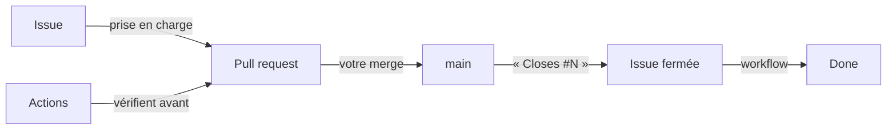

Vous avez maintenant toutes les pièces. Cette courte leçon les assemble en
une seule image — la chaîne complète, celle que vous installerez telle quelle
sur vos vrais projets.

## La chaîne, de bout en bout

Deux familles d'automates s'y partagent le travail, et ne se marchent jamais
dessus :

- **les Actions vérifient AVANT** : sur la PR, contenu proposé, verdict
  vert/rouge — l'aide à la décision ;
- **les workflows du Project rangent APRÈS** : issue fermée, carte déplacée —
  le compte-rendu.

Entre les deux, un seul geste humain : votre fusion. Tout le reste — la
rédaction, les contrôles, la fermeture, le rangement — s'est retiré du
quotidien. Le tableau dit vrai parce que plus personne ne le tient : il
**découle**.

## Constatez-le sur pièce

Le tour du propriétaire, sur votre bac à sable :

1. L'onglet **Actions** : l'historique des exécutions raconte vos derniers
   gestes — la fusion du formulaire, celle de l'Action, la PR cassée puis
   réparée. Chaque événement du dépôt y a laissé sa ligne.
2. Le **Board** : Done s'est peuplé tout seul au fil des modules — retrouvez-y
   la carte de l'issue du formulaire (module 7), fermée par sa PR sans un
   geste.
3. La page **Milestones** : l'avancement de V2 correspond exactement à ce que
   Done raconte — deux vues du même réel, alimentées par la même chaîne.

## Critères de réussite

- [ ] l'onglet Actions montre une ligne d'exécution pour chaque événement récent
- [ ] la carte de l'issue du formulaire est dans Done, fermée par sa PR
- [ ] la barre du milestone V2 et la colonne Done racontent la même chose
