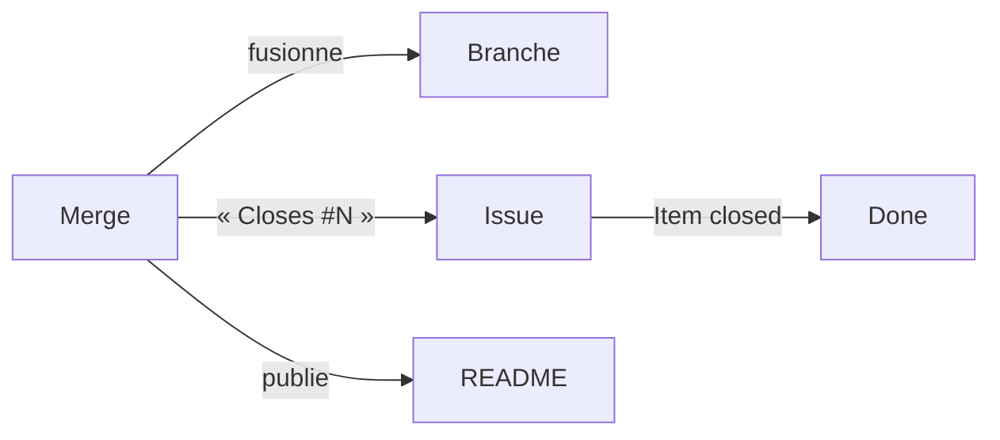

Tout est en place : une issue ouverte, une PR reliée par « Closes », des
workflows qui veillent sur le tableau. Il ne reste qu'un geste — le vôtre —
et toute la mécanique se déclenche en cascade. C'est la leçon la plus courte
de la formation, et la plus satisfaisante.

## Le seul geste manuel : dire oui

Dans cette chaîne, une seule décision n'appartient qu'à un humain : **fusionner
ou pas**. Tout ce qui précède (écrire, brancher, proposer) peut se déléguer ;
tout ce qui suit (fermer, ranger, publier) est automatique. Le poste de
pilotage tient dans un bouton vert.

À la fusion, dans l'ordre et sans que personne ne touche à rien :

## À vous

1. Relisez une dernière fois *Files changed* — c'est votre relecture qui
   autorise. Puis **Merge pull request**, et confirmez. (GitHub propose
   ensuite de supprimer la branche : oui — une branche fusionnée est un
   échafaudage qui a servi.)
2. Maintenant, le tour des constats, dans l'ordre de la cascade :
   - la PR porte le badge violet **Merged** ;
   - l'issue est **fermée** — sans votre aide — et son fil raconte la fusion ;
   - sa carte est dans **Done** au tableau ;
   - le README affiché sur la page du dépôt montre la nouvelle section V2 ;
   - la page Milestones : la barre de V2 a avancé (une issue fermée).

Cinq effets, un clic. C'est cette cascade que vous installerez sur vos vrais
projets — et c'est elle qui rend le tableau digne de confiance : il ne dit que
ce qui s'est réellement passé.

## Critères de réussite

- [ ] ma PR porte le badge violet « Merged »
- [ ] l'issue s'est fermée toute seule, la fusion citée dans son fil
- [ ] sa carte est dans Done sans que je l'aie déplacée
- [ ] le README de la page du dépôt affiche la section V2 détaillée
- [ ] la barre du milestone V2 a avancé
