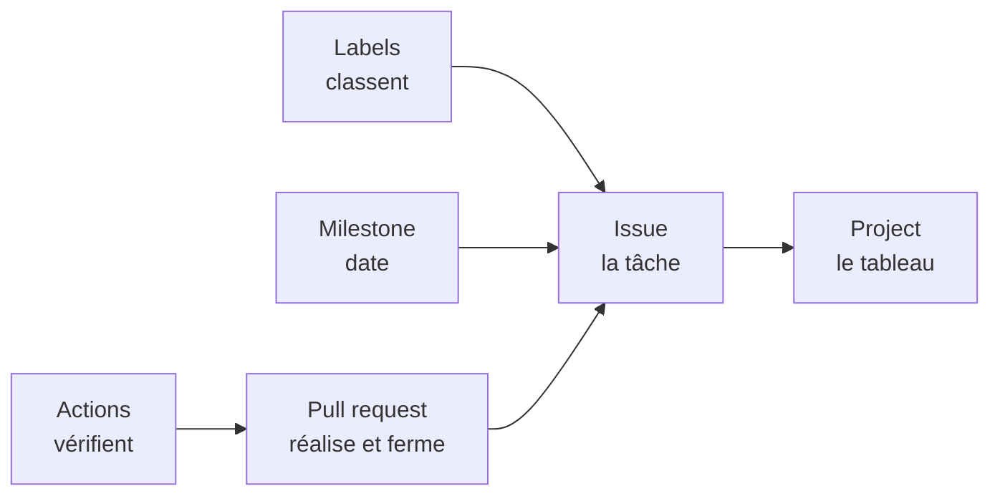

Six mots suffisent pour couvrir tout ce que GitHub propose en gestion de
projet. Cette leçon les pose une fois pour toutes ; chaque module suivant en
reprend un et le fait manipuler.

## Le dépôt, et tout ce qui s'y rattache

Le **dépôt** (repository, en anglais) est le dossier du projet hébergé sur
GitHub : le code, mais aussi tout l'outillage de gestion qui gravite autour.
Voici les six mots, chacun avec sa traduction en langage courant :

| Mot GitHub | En clair | Ce que ça fait |
| --- | --- | --- |
| Issue | la tâche | décrit UN travail à faire ; se discute, se ferme |
| Label | l'étiquette | classe les tâches : bug, urgent, V2… |
| Milestone | le jalon | regroupe des tâches vers une échéance : « V1 » |
| Project | le tableau de bord | affiche les tâches en colonnes, façon Kanban |
| Pull request | la proposition de changement | soumet une modification du code à relecture avant de l'intégrer |
| Action | l'automate | déclenche des vérifications automatiques |

Kanban — le tableau à colonnes venu de l'industrie japonaise : chaque tâche est
une carte, chaque colonne un état (À faire, En cours, Fait), et une carte se
déplace de gauche à droite jusqu'à la fin.

## Comment tout s'articule

En une phrase : **l'issue décrit le travail, le label le classe, le milestone
le date, le Project l'affiche, la pull request le réalise et le ferme,
l'Action le vérifie.**

Le détail viendra module par module. Ce qui compte aujourd'hui : ces six
briques ne sont pas six outils séparés — elles se tiennent. C'est ce chaînage
qui fera, plus loin, qu'un tableau de bord se met à jour sans qu'on le touche.

## Constatez-le sur pièce

Pas encore de bac à sable : allez d'abord voir un vrai projet, en taille
réelle. Le dépôt public de Visual Studio Code — l'éditeur de code de
Microsoft — est l'un des plus actifs au monde, et tout s'y observe sans
risque : en lisant, vous ne pouvez rien y casser.

Ouvrez [github.com/microsoft/vscode](https://github.com/microsoft/vscode),
puis :

1. L'onglet **Issues**, dans la barre en haut du dépôt : des milliers de
   tâches ouvertes, chacune avec son numéro.
2. Ouvrez n'importe quelle issue : dans la colonne de droite, repérez ses
   **labels** colorés — et parfois son **milestone**.
3. Revenez, puis ouvrez l'onglet **Pull requests** : même allure que les
   issues, mais chacune porte une modification du code, avec des relecteurs.
4. Sous l'onglet Issues, cliquez le bouton **Milestones** : la liste des
   jalons du projet, chacun avec sa barre d'avancement.

## Critères de réussite

- [ ] j'ai ouvert l'onglet Issues de microsoft/vscode et vu le nombre de tâches ouvertes
- [ ] j'ai ouvert une issue et repéré ses labels dans la colonne de droite
- [ ] j'ai ouvert une pull request et vu qu'elle porte une modification du code
- [ ] j'ai ouvert la liste des milestones et vu leur barre d'avancement
- [ ] j'ai retrouvé dans le tableau de cette leçon lequel des six mots désigne le tableau Kanban
