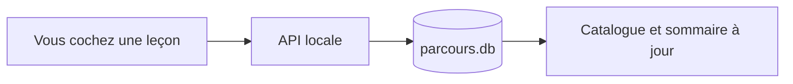

Votre progression vit dans une base SQLite locale, à l'écart de vos contenus.
Les dossiers de formation ne sont jamais modifiés par Parcours.

## Ce qui est enregistré

Une ligne par leçon terminée : l'identifiant de la formation, celui de la leçon,
et la date. Rien d'autre — pas de position de lecture, pas de temps passé.

## Reprendre où j'en étais

Le bouton « Reprendre » ouvre la première leçon non cochée dans l'ordre du
manifeste. Quand tout est terminé, il devient « Revoir » et ramène au début.

:::astuce
Deux onglets ouverts sur la même formation se resynchronisent tout seuls : les
données sont rechargées à chaque navigation et au retour sur la fenêtre.
:::

## Faire le ménage

Deux actions, toutes deux confirmées avant d'agir :

- **Nettoyer** retire les coches devenues orphelines après un changement d'`id`.
- **Réinitialiser** efface toute la progression de la formation ouverte.
