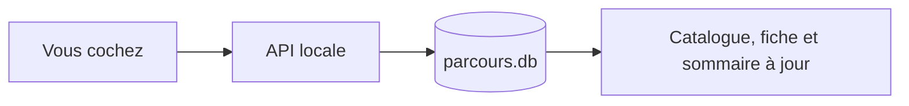

Votre progression vit dans une base locale, à l'écart de vos contenus. Les
dossiers de `formations/` ne sont jamais modifiés quand vous lisez.

## Ce qui est enregistré

Une ligne par leçon terminée et une ligne par critère coché : l'identifiant de
la formation, celui de la leçon, et la date de la bascule. Rien d'autre. Pas de
position de lecture, pas de temps passé, pas de statistiques.

Tout cela est **rattaché à votre compte**. Deux personnes qui lisent la même
formation sur la même machine ne se voient pas l'une l'autre.

## Reprendre où j'en étais

Le bouton de la fiche ouvre la première leçon non terminée, dans l'ordre du
sommaire. Il s'appelle « Commencer » si vous n'avez rien fait, « Reprendre » si
vous êtes en route, et « Revoir la formation » quand tout est terminé.

:::astuce
Deux onglets ouverts sur la même formation se resynchronisent tout seuls : les
données sont rechargées à chaque navigation et au retour sur la fenêtre.
:::

## Les clés de la progression

Ce qui identifie une leçon, c'est son `id` dans le manifeste — pas son titre, ni
sa place. Vous pouvez renommer une leçon ou la déplacer dans un autre module :
la coche suit.

Changer son `id`, en revanche, revient à créer une leçon neuve. L'ancienne coche
devient **orpheline**. Parcours vous le signale sur la fiche, avec un bouton
« Nettoyer » — il ne le fait jamais dans votre dos.

## Quand une leçon en suppose d'autres

Certaines leçons s'appuient sur ce qui précède. L'auteur peut le déclarer, et
Parcours compare alors cette liste à **votre** progression : à l'ouverture, si
une leçon supposée n'est pas terminée, un bandeau la nomme, avec un lien pour y
aller.

Le bandeau ne verrouille rien. Le contenu est entier, les critères se cochent,
« Marquer comme terminé » fonctionne — on vous prévient, on ne décide pas à
votre place. Terminez la leçon supposée, revenez : le bandeau a disparu.

Vous pouvez le voir dans cette formation : l'exercice guidé du dernier module
déclare trois leçons supposées.

## Faire le ménage

Deux actions, toutes deux confirmées avant d'agir, et toutes deux disponibles
même en lecture : elles vous appartiennent, elles ne touchent aucun fichier.

- **Nettoyer** retire les coches devenues orphelines.
- **Réinitialiser ma progression** remet la formation ouverte à zéro, critères
  compris.

## Critères de réussite

- [ ] j'ai marqué une leçon comme terminée : la coche est apparue dans le sommaire et la barre a avancé
- [ ] j'ai re-cliqué : la leçon est repassée en cours, les compteurs sont redescendus
- [ ] j'ai ouvert deux onglets sur la même formation, coché dans l'un, et l'autre s'est mis à jour tout seul
- [ ] j'ai retrouvé ma progression après avoir rechargé la page
- [ ] j'ai vu que « Réinitialiser ma progression » demande confirmation avant d'agir
- [ ] j'ai ouvert « Exercice guidé : une formation de zéro » sans avoir terminé les leçons qu'il suppose : un bandeau les nomme, sous le titre et avant le texte
- [ ] j'ai cliqué un titre dans le bandeau : je suis arrivé sur la leçon, sans rechargement de la page
- [ ] j'ai vérifié qu'avec le bandeau, le contenu est entier et « Marquer comme terminé » reste actif
- [ ] j'ai terminé une leçon supposée puis suis revenu : elle a quitté le bandeau
